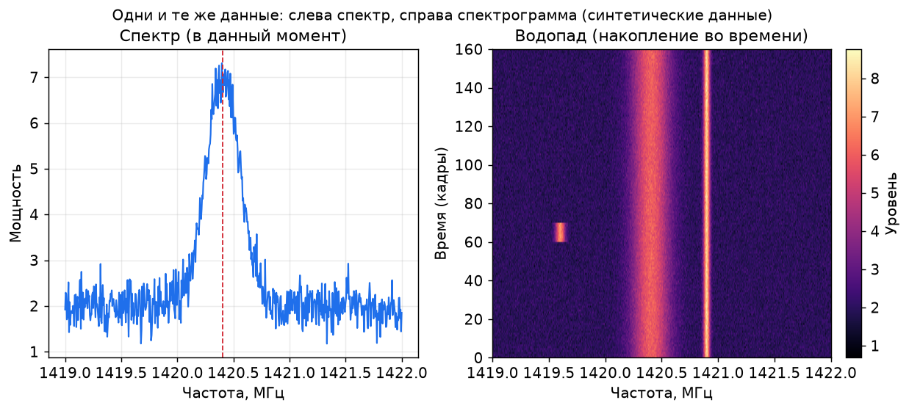
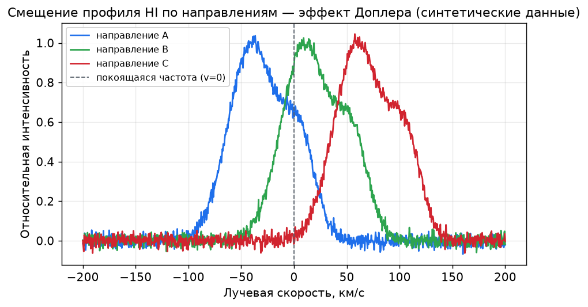
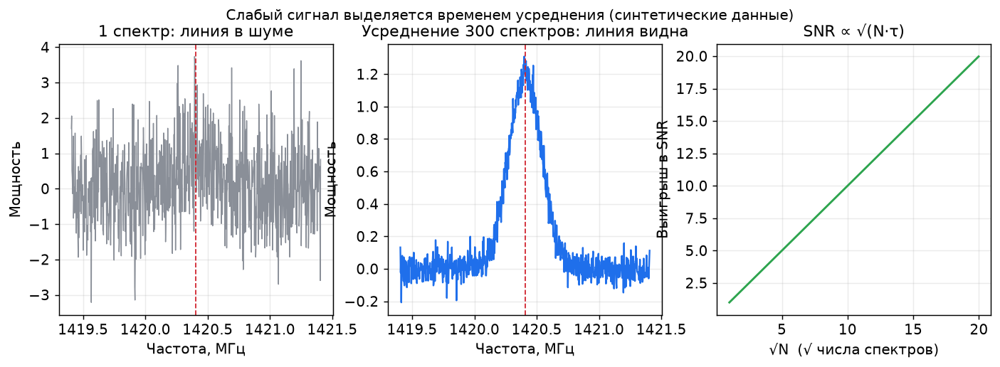

# 02. Основы физики

← [Введение](01-introduction.md) · [Оглавление](../README.md) · Далее: [Оборудование →](03-equipment.md)

---

Глава рассчитана на читателя без подготовки по физике и астрофизике, впервые знакомящегося с радиоастрономией.

Цель — не сдача экзамена, а формирование нескольких опорных представлений. С ними последующие главы перестают выглядеть набором непонятных процедур.

Материал стоит читать неспешно. Если термин остаётся неясным, ниже он поясняется другими словами.

### Как записаны формулы

В таблице слева — символ из формулы, справа — его смысл.

| Символ | Читается | Смысл | Типичная единица |
|--------|----------|--------|------------------|
| λ | лямбда | длина волны | м, см |
| f | эф | частота | Гц, МГц, ГГц |
| ν | ню | частота (в астрофизике вместо f часто пишут ν) | Гц |
| c | цэ | скорость света в вакууме | м/с |
| T | тэ | период колебания | с |
| Δf | дельта эф | сдвиг частоты | Гц, кГц |
| f₀ | эф-ноль | покоящаяся (лабораторная) частота линии | МГц |
| v | вэ | лучевая скорость (к наблюдателю / от него) | км/с |
| τ | тау | время накопления (усреднения) | с |
| D | дэ | характерный размер антенны (диаметр зеркала) | м |
| θ | тета | ширина луча антенны | радианы или градусы |

Знак ≈ означает «приближённо равно».
Знак ∝ означает «пропорционально».

---

## 0. Краткий обзор задачи

Помимо видимого света (излучения, воспринимаемого глазом и обычным телескопом), Вселенная испускает **невидимые радиоволны**.

Для их приёма к компьютеру подключается небольшой радиоприёмник с антенной, которая наводится в нужную область неба. Результат наблюдения — **график**: на каких частотах небо «шумит» сильнее.

Иногда на этом графике возникает особенность — след водорода в Галактике. Её регистрация в домашних условиях и есть основная учебная цель.

Более строгая теория рассматривается позднее.

---

## 1. Три близких термина

### Астрономия
Наука о том, **что находится на небе** и как оно движется и выглядит: Солнце, Луна, планеты, звёзды, Галактика.

### Астрофизика
Применение физики к небесным объектам: почему звезда светит, из чего состоит газ между звёздами, каковы там температуры и скорости.

Для начального уровня различие несущественно: астрономия отвечает на вопрос «что на небе», астрофизика — «почему оно такое».

### Радиоастрономия
Раздел астрономии, в котором вместо видимого света принимаются **радиоволны** космического происхождения.

Обычный телескоп можно сравнить с большим «глазом», радиотелескоп — с большим «ухом» в сочетании с компьютером.

В домашних условиях доступно очень небольшое такое «ухо», и этого достаточно для учебных задач.

---

## 2. Свет — не только видимое излучение

Глаз воспринимает лишь узкую полосу излучений, называемую **видимым светом**.

Природа испускает «свет» и других видов:

- радиоволны (длинные);
- микроволны (используются в Wi‑Fi и бытовых печах, но это техногенные источники, не космические);
- инфракрасное (тепловое) излучение;
- видимый свет;
- ультрафиолет;
- рентгеновское излучение;
- гамма-излучение.

Всё перечисленное — разновидности одного явления. Общее название: **электромагнитное излучение**.

Определение:

> Электромагнитное излучение — колебания электрического и магнитного полей, распространяющиеся в пространстве.

Для начального уровня достаточно образа **волны на воде**: локальное возмущение порождает рябь, которая распространяется дальше.

Радиоастрономия имеет дело с космической «рябью» очень большой длины волны (по меркам света).

---

## 3. Волна: частота и длина

В качестве наглядной модели удобны волны на поверхности воды.

### Длина волны λ
Расстояние между двумя соседними гребнями.
Для радиолинии водорода λ ≈ 21 см, поэтому её называют **линией 21 см**.

### Частота f
Число гребней, проходящих через фиксированную точку за одну секунду.

- 1 колебание в секунду ⇒ f = 1 Гц
- 1 кГц = 10³ Гц
- 1 МГц = 10⁶ Гц
- 1 ГГц = 10⁹ Гц

Примеры:

| Источник | f | λ |
|-----|-------|-------------|
| FM-радио | ∼ 100 МГц | ∼ 3 м |
| Wi‑Fi | ∼ 2.4 ГГц | ∼ 12.5 см |
| Линия HI | ≈ 1420.4 МГц | ≈ 21.1 см |

### Период T

Период — время одного полного колебания:

```text
T = 1 / f
```

- T — период, с
- f — частота, Гц

При f = 1420 МГц = 1.42 · 10⁹ Гц период очень мал (∼ 0.7 нс). На практике при работе с SDR удобнее оперировать частотой f, а не периодом.

### Основная связь: λ, f и c

Электромагнитная волна в вакууме распространяется со скоростью света c, поэтому:

```text
λ = c / f ,   f = c / λ ,   c = λ · f
```

**Обозначения:**

| Символ | Смысл | Значение / единица |
|--------|--------|---------------------|
| λ | длина волны | м |
| f | частота | Гц |
| c | скорость света | c ≈ 2.998 · 10⁸ м/с ≈ 3.00 · 10⁸ м/с |

Качественно:

- выше f ⇒ меньше λ;
- ниже f ⇒ больше λ.

### Численный пример для водорода

При f = 1.420 · 10⁹ Гц:

```text
λ = (3.00 · 10⁸ м/с) / (1.420 · 10⁹ Гц) ≈ 0.211 м = 21.1 см
```

Опорные значения:

> **Линия HI: f₀ ≈ 1420.406 МГц, λ ≈ 21.1 см.**

Точное справочное значение: f₀ = 1420.4057517667 МГц. Для домашних наблюдений достаточно 1420.406 МГц.

---

## 4. Почему радиодиапазон удобен для наблюдений неба

Облачность существенно мешает оптическому телескопу. Радиоволны многих диапазонов **проходят сквозь облака** значительно свободнее.

Однако возникает другое препятствие — не световая, а **радиочастотная засветка** города:

- Wi‑Fi;
- маршрутизаторы;
- недорогие зарядные устройства;
- LED-освещение;
- импульсная электроника.

В оптике аналогом городской помехи является уличный фонарь; в радиодиапазоне — излучение бытового импульсного блока питания.

Поэтому наблюдателю приходится не только наводить антенну на небо, но и выявлять и устранять бытовые источники помех.

---

## 5. Спектр — ключевое понятие

**Спектр** отвечает на вопрос:

> На каких частотах сигнал сильный, а на каких слабый?

Знакомый пример — радуга: это спектр видимого света, разложенный по цветам (длинам волн).
В радиодиапазоне роль цветов играют **частоты (в мегагерцах)**, а результат отображается в виде **графика**.

Другая аналогия — эквалайзер аудиосистемы:

- слева низкие частоты;
- справа высокие;
- высота столбика — уровень сигнала.

Спектр в SDR устроен сходным образом.

### Два вида отображения в программе

1. **Спектр**
   Горизонтальная ось — частота, вертикальная — уровень сигнала.

2. **Спектрограмма (водопад, waterfall)**
   Тот же спектр, развёрнутый во времени: лента, где яркая полоса соответствует сильному сигналу.



*Слева — мгновенный спектр, справа — водопад (та же информация, развёрнутая во времени). Синтетические данные. Широкая полоса — сигнал HI, узкая яркая линия справа — помеха RFI.*

Формулировка «зарегистрирована линия водорода» обычно означает:

> В окрестности 1420 МГц на графике возникла особенность (профиль), отсутствующая (или почти отсутствующая) при наведении антенны в сторону от Млечного Пути.

Это не изображение Галактики, а **спектральная подпись** межзвёздного газа.

---

## 6. Происхождение «сигналов космоса»

Космос не издаёт звука в привычном смысле.
«Услышать» здесь означает принять электромагнитную волну антенной и преобразовать её в данные на экране.

Основные источники для начального уровня:

### Солнце
Близкий и мощный источник. Чаще проявляется как **общий подъём уровня шума** при наведении антенны. Удобная первая цель.

### Галактика (Млечный Путь)
Солнечная система находится внутри огромного диска из звёзд и газа. Полоса Млечного Пути на ночном небе — это взгляд вдоль плоскости этого диска.

Межзвёздная среда содержит большое количество **водорода** — простейшего и самого распространённого элемента.

### Линия водорода (HI, 21 см)
Атомы нейтрального водорода излучают на строго определённой частоте — около **1420.4 МГц**.

Причина связана со спинами электрона и протона и рассматривается отдельно. Для начала достаточно утверждения:

> Водород в Галактике даёт спектральную линию около 1420.4 МГц.

Именно её и регистрируют любители.

### Атом и водород (минимум)

**Атом** — мельчайшая структурная единица вещества. **Водород** — простейший элемент: одно ядро (протон) и один электрон. Обозначение **HI** («аш-один») соответствует нейтральному водороду (латинская запись «H I», а не слог «хай»). В космосе водород есть и в звёздах, и в холодных облаках межзвёздной среды; именно облака дают линию 21 см. Знание уровней энергии на данном этапе не требуется — достаточно запомнить: **HI = нейтральный водород = основной учебный сигнал**.

---

## 7. Смещение частоты: эффект Доплера

При проезде автомобиля с сиреной тон звука сначала выше, затем ниже. Это проявление **эффекта Доплера**.

С радиоволнами наблюдается то же самое:

- газ движется **к наблюдателю** ⇒ регистрируемая частота f немного выше f₀;
- газ движется **от наблюдателя** ⇒ f немного ниже f₀.

В Галактике различные облака водорода имеют разные скорости, поэтому вместо одной узкой линии часто наблюдается **широкий профиль**.



*При наведении в разные области неба профиль HI смещается по скорости — это прямое проявление эффекта Доплера (синтетические данные).*

### Нерелятивистская формула (рабочее приближение)

При скорости газа много меньше скорости света (v ≪ c):

```text
Δf / f₀ ≈ v / c
```

или, выражая скорость:

```text
v ≈ c · (Δf / f₀) = c · (f₀ − f) / f₀
```

**Обозначения:**

| Символ | Смысл |
|--------|--------|
| f₀ | покоящаяся частота линии HI (≈ 1420.405751 МГц) |
| f | частота, наблюдаемая на спектре |
| Δf = f₀ − f | сдвиг частоты (в данной записи; знак зависит от соглашения) |
| v | лучевая скорость источника относительно наблюдателя |
| c | скорость света |

Правило знака (в заметках достаточно придерживаться одного соглашения последовательно):

- при v ≈ c(f₀ − f)/f₀ величина **v > 0**, когда f < f₀ (источник удаляется, частота смещена вниз — «красное» смещение по частоте).

В профессиональных работах знаки и системы отсчёта (LSR и др.) оговариваются отдельно. На начальном этапе важнее форма профиля и её изменение по направлениям.

### Численный пример

Пусть f₀ = 1420.406 МГц, v = 20 км/с = 2.0 · 10⁴ м/с, c = 3.00 · 10⁸ м/с:

```text
Δf ≈ f₀ · (v / c)
= 1.420406 · 10⁹ Гц · (2.0 · 10⁴) / (3.00 · 10⁸)
≈ 9.5 · 10⁴ Гц
≈ 95 кГц
```

Величина 95 кГц мала относительно 1420 МГц, но на спектре линии HI она хорошо различима.

Практический вывод:

> Не следует ожидать узкого пика строго на 1420.400000 МГц. Ищется профиль в окрестности f₀, зависящий от направления на Млечный Путь.

---

## 8. Слабость сигнала и понятие шума

Космические источники удалены, а домашняя антенна невелика, поэтому принимаемый сигнал очень слаб.

Одновременно присутствует множество мешающих факторов:

| Источник помех | Простыми словами |
|------------|------------------|
| Шум приёмника | Собственный шум электроники |
| Потери в кабеле | Сигнал ослабевает по пути |
| Городской RFI | Бытовая электроника излучает в эфир |
| Природный фон | Излучение неба и Земли |

**RFI** = radio frequency interference = радиочастотные помехи.

Практическое правило 1:

> Если «космический пик» не меняется при повороте антенны в разные области неба, его источником почти наверняка является бытовая электроника (розетка, лампа, зарядное устройство), а не Галактика.

Практическое правило 2:

> Слабый сигнал выделяют не увеличением усиления, а **более длительным усреднением**.

### Отношение сигнал/шум SNR

В первом приближении:

```text
SNR = P_signal / P_noise
```

| Символ | Смысл |
|--------|--------|
| SNR | signal-to-noise ratio, отношение сигнал/шум |
| P_signal | мощность полезного сигнала |
| P_noise | мощность шума в той же полосе |

Чем выше SNR, тем увереннее выделяется линия.

### Роль времени усреднения

Для многих радиоастрономических измерений (радиометрический предел) чувствительность улучшается приблизительно так:

```text
SNR ∝ √(Δν · τ)
```

или, при фиксированной полосе Δν:

```text
SNR ∝ √τ
```

| Символ | Смысл |
|--------|--------|
| Δν | ширина частотной полосы (bandwidth), Гц |
| τ | время накопления (усреднения), с |

Практическое следствие:

- увеличение τ в **4 раза** ⇒ рост SNR примерно в **2 раза**;
- поэтому усреднение в течение минут и десятков минут — норма, а не признак неэффективности.

Усреднение аналогично фотографии с длинной выдержкой: случайный шум сглаживается, повторяющийся сигнал проявляется.



*Слева — линия тонет в шуме в одном спектре; в центре — она видна после усреднения многих спектров; справа — рост SNR пропорционален √N (синтетические данные).*

Полная «формула радиометра» с шумовыми температурами системы сложнее; на начальном этапе достаточно зависимости ∝ √τ.

---

## 9. Назначение антенны и её направленность

**Антенна** — проводящая конструкция определённой формы и размера, эффективно принимающая волны нужного диапазона.

Аналогии:

- ухо лучше воспринимает звук с определённого направления;
- спутниковая антенна принимает преимущественно с одного направления;
- комнатная FM-антенна принимает широко и слабонаправленно.

Направленность антенны описывается **диаграммой направленности**: она показывает, откуда приём хороший, а откуда — слабый.

### Оценка ширины луча зеркала

Для антенны диаметром D на длине волны λ порядок угловой ширины главного лепестка:

```text
θ ≈ λ / D          (θ в радианах)
```

Это **оценка порядка величины**. Более точно ширина луча по уровню половинной мощности (HPBW) для параболического зеркала:

```text
θ_HPBW ≈ 1.2 · (λ / D) рад ≈ 70° · (λ / D)
```

| Символ | Смысл |
|--------|--------|
| θ | характерная ширина луча |
| λ | длина волны |
| D | диаметр апертуры (зеркала) |

Пример: λ = 0.21 м, D = 1 м.

```text
грубая оценка:   θ ≈ 0.21 / 1 = 0.21 рад ≈ 12°
точнее (HPBW):   θ ≈ 70° · 0.21 ≈ 15°
```

Вывод: зеркало малого диаметра имеет широкий луч, большого — узкий. Домашняя антенна не даёт изображение уровня VLA, но для регистрации профиля HI её разрешения достаточно.

Практически важно контролировать:

- направлена ли антенна в небо или в препятствие;
- ориентирована ли она вдоль плоскости Млечного Пути или поперёк;
- не попадает ли в луч источник помех (например, маршрутизатор).

Опорное правило:

> Направление антенны — часть эксперимента, а не второстепенная деталь.

---

## 10. Что такое SDR

Ранее радиоприёмники собирались из множества аппаратных узлов под конкретную задачу.
**SDR (Software Defined Radio)** — приёмник, в котором бо́льшую часть обработки выполняет программа на компьютере.

Схема работы:

1. антенна принимает волны;
2. SDR преобразует их в цифровой поток;
3. программа строит спектр или спектрограмму;
4. данные сохраняются для последующего анализа.

**RTL-SDR** — недорогой учебный SDR-приёмник в виде USB-модуля. Для знакомства с темой его возможностей достаточно.

**МШУ (LNA, малошумящий усилитель)** устанавливается ближе к антенне, чтобы слабый сигнал не терялся в кабеле. По назначению он аналогичен предусилителю, расположенному рядом с микрофоном, а не в конце длинного провода.

---

## 11. Полоса обзора: почему не виден весь радиодиапазон одновременно

Приёмник обрабатывает не весь эфир, а частотное **окно** шириной Δν (bandwidth).

У простого RTL-SDR обычно:

```text
Δν ∼ 1…3 МГц
```

Задаётся центральная частота f_c (center frequency), и наблюдается интервал:

```text
[ f_c − Δν/2 ,  f_c + Δν/2 ]
```

| Символ | Смысл |
|--------|--------|
| f_c | центральная частота настройки SDR |
| Δν | ширина полосы обзора |

Для линии HI типичный старт: f_c ≈ 1420.4 МГц, Δν ≈ 1…2 МГц.

Полоса связана с частотой дискретизации f_s (упрощённо: она не превышает величину порядка f_s). Поэтому на слабом ноутбуке снижение f_s уменьшает и нагрузку на процессор, и Δν.

---

## 12. Карта неба: основные объекты

Краткий ориентир (развёрнутые определения — в [глоссарии](glossary.md)):

- **Земля** — местоположение наблюдателя и антенны.
- **Солнце** — ближайшая звезда; сильный радиоисточник для учебных наблюдений.
- **Млечный Путь** — Галактика изнутри; светлая полоса на небе — взгляд вдоль плоскости диска, где сигнал HI сильнее.
- **Облака HI** — разреженные области нейтрального водорода в межзвёздной среде (не водяные облака); именно они дают линию 21 см.
- **Другие галактики** — также видны в радиодиапазоне, но для простой антенны это обычно преждевременно.

---

## 13. Что реально доступно начинающему

Речь идёт не об открытии для науки, а о результатах **для себя**:

1. Подтверждение работоспособности тракта (FM, самолёты).
2. Заметный подъём уровня при наведении на Солнце.
3. Наличие в окрестности 1420 МГц профиля, зависящего от направления на Млечный Путь.
4. Навык отличать бытовые помехи от космического сигнала.

Этого достаточно, чтобы обоснованно говорить о занятиях радиоастрономией.

На данном этапе не требуется:

- знание общей теории относительности;
- квантовые числа наизусть;
- построение интерферометра уровня крупных обсерваторий;
- дискуссии по космологии.

---

## 14. Сводка формул главы

```text
λ = c / f ,   T = 1 / f
```

```text
Δf / f₀ ≈ v / c ,   v ≈ c · (f₀ − f) / f₀
```

```text
SNR ∝ √(Δν · τ)
```

```text
θ ≈ λ / D   (оценка; HPBW ≈ 70° · λ/D)
```

Константы, которые полезно помнить:

| Величина | Значение |
|----------|----------|
| c | 2.998 · 10⁸ м/с ≈ 3.00 · 10⁸ м/с |
| f₀ (HI) | 1420.405751 МГц |
| λ (HI) | ≈ 21.1 см |

---

## 15. Краткий словарь главы

Краткая памятка. Полный список определений — в **[глоссарии](glossary.md)**.

### Символы

| Символ | Смысл |
|--------|--------|
| λ | длина волны |
| f, ν | частота |
| T | период колебания |
| c | скорость света |
| f₀ | покоящаяся частота линии |
| Δf | сдвиг частоты |
| v | лучевая скорость |
| τ | время усреднения |
| Δν | полоса обзора |
| f_c | центральная частота SDR |
| SNR | отношение сигнал/шум |
| θ | ширина луча антенны |
| D | размер (диаметр) антенны |

### Термины

| Термин | Краткое определение |
|-------|---------------------|
| Спектр | график уровня сигнала по частотам |
| Спектрограмма (водопад) | спектр, развёрнутый во времени |
| Профиль линии | форма линии HI после усреднения |
| HI / 21 см | радиолиния нейтрального водорода |
| Млечный Путь | Галактика; вдоль плоскости диска сигнал HI сильнее |
| On / Off | спектр на цель / в сторону от цели |
| RFI | искусственные радиопомехи |
| Шум | случайный фон, маскирующий сигнал |
| Усреднение | накопление данных → рост SNR |
| Антенна | проводящий приёмный элемент нужного размера |
| МШУ (LNA) | малошумящий усилитель у антенны |
| SDR | приёмник с программной обработкой |
| Эффект Доплера | смещение частоты при движении источника |
| Калибровка | приведение измерений к сравнимому виду |
| Артефакт | ложный пик (не космического происхождения) |

Незнакомый термин из последующих глав удобно уточнять в [глоссарии](glossary.md).

---

## 16. Самопроверка

Материал считается усвоенным, если на следующие вопросы можно ответить своими словами:

1. Чем радиоастрономия отличается от наблюдений в оптический телескоп?
2. Что такое спектр и почему это не изображение?
3. Какая связь существует между λ, f и c?
4. Как по Δf оценить v?
5. Почему SNR растёт как √τ?
6. Зачем сравнивать направления на Млечный Путь и в сторону от него?
7. Почему пик, всегда находящийся в одном и том же месте, вызывает подозрение?

Если ответ затруднителен, соответствующий раздел стоит перечитать.

---

## 17. Ключевые положения главы

1. Глаз воспринимает не всё излучение; радиодиапазон — его невидимая часть.
2. Результат наблюдения — **график зависимости уровня от частоты**, а не изображение.
3. Рабочие формулы: λ = c/f, v ≈ c·(f₀−f)/f₀, SNR ∝ √τ.
4. Основная учебная цель — **линия водорода**: f₀ ≈ 1420.406 МГц, λ ≈ 21 см.
5. Главные препятствия — **шум и бытовые помехи**.
6. Слабый сигнал выделяется **временем усреднения и аккуратной антенной**.
7. Умение отличать бытовую помеху от космического сигнала — важный первый навык.

---

## Далее

Теоретического минимума достаточно. Следующая глава — что приобрести для старта:

→ [03. Оборудование](03-equipment.md)

Дополнительные определения — в [глоссарии](glossary.md).

---

← [Введение](01-introduction.md) · [Оглавление](../README.md) · Далее: [Оборудование →](03-equipment.md)
