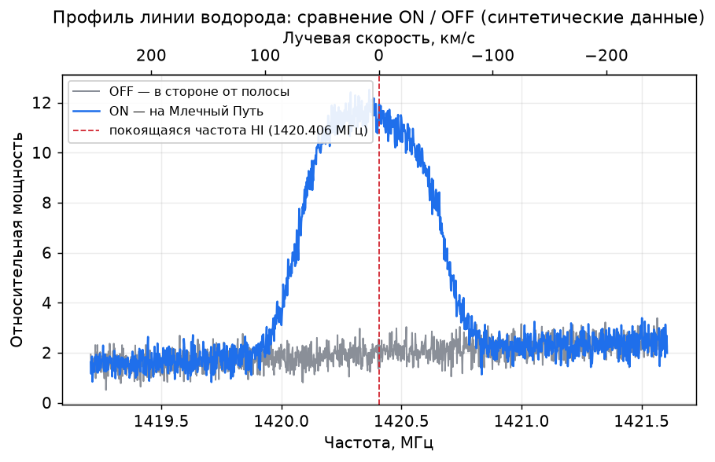

# 06. Линия водорода (21 см)

← [Первые наблюдения](05-first-observations.md) · [Оглавление](../README.md) · Далее: [Анализ данных →](07-data-analysis.md)

---

Центральная глава руководства. Успешная регистрация линии означает переход от работы с SDR как таковой к собственно радиоастрономии.

## Что регистрируется

- Покоящаяся частота: **1420.405751 МГц** (для практики: **1420.406 МГц**).
- Длина волны: **~21.1 см**.
- Источник: нейтральный водород (HI) в Млечном Пути (и небольшой вклад локального газа).

На графике это не обязательно один узкий пик. Часто наблюдается **широкий профиль**, обусловленный разными скоростями облаков.

## Как выглядит результат



*Пример профиля HI (синтетические данные для иллюстрации). Верхняя ось — пересчёт частоты в лучевую скорость.*

Признак HI: «горб» присутствует на ON (антенна на Млечный Путь) и отсутствует (или заметно слабее) на OFF (в стороне от полосы). Из-за эффекта Доплера вершина может быть немного сдвинута относительно f₀. Ровная линия, одинаковая в обоих направлениях, — это фон или помеха, а не водород.

## Требуемая конфигурация

Минимум:

```text
антенна HI → короткий кабель → МШУ → (фильтр) → кабель → RTL-SDR → ПК
```

Без МШУ в городе или на короткой антенне приём тоже возможен, но вероятность успеха ниже.

Детали аппаратной части — в [03. Оборудование](03-equipment.md).

## Настройка частоты и полосы

Стартовые параметры:

| Параметр | Старт |
|----------|--------|
| Center | 1420.4 МГц |
| Bandwidth / sample rate | ~1–2.4 МГц (устойчивое значение) |
| Разрешение FFT | достаточное для различения структуры в десятки кГц |
| Gain | баланс: без «глухоты» и без перегрузки |

Перед сессией модулю дают прогреться 10–20 минут и проверяют PPM.

## Наведение антенны

Практические рекомендации:

1. Определить положение плоскости **Млечного Пути** (Stellarium или аналог).
2. Направить антенну вдоль ярких участков Млечного Пути над горизонтом.
3. Сравнить с направлением **на галактический полюс** (приблизительно в сторону от полосы).

Ожидание:

- вдоль плоскости — профиль HI заметнее;
- к полюсу — слабее или практически отсутствует.

Это основная проверка на отсутствие локальной помехи на 1420 МГц.

## Протокол первой успешной записи

### Шаг 1. Предварительная оценка помех

1. Включить систему.
2. Просмотреть спектр в окрестности 1420.4.
3. Отметить узкие постоянные пики — кандидаты в RFI.
4. Отключить поблизости подозрительную электронику и перепроверить.

### Шаг 2. Опорный спектр

Записать спектр в «слабом» направлении (полюс / земля / заведомо неблагоприятная сторона) с усреднением 5–15 минут.

### Шаг 3. Целевой спектр

Навести антенну на Млечный Путь. Записать с **теми же** gain/PPM/полосой ещё 5–15 минут.

### Шаг 4. Сравнение

Вычесть или наложить профили. Признак — избыток в области ожидаемых доплеровских сдвигов, не обязательно строго на 1420.406.

### Шаг 5. Повтор

Повторить в другой день. Настоящий сигнал HI должен воспроизводиться по положению на небе, а не по включению бытовых приборов.

## Продолжительность усреднения

Ориентировочная последовательность:

| Время | Ожидаемый результат |
|-------|-------------|
| Секунды | Часто только шум/RFI |
| 1–5 минут | Иногда намёк на профиль |
| 10–30 минут | Реалистичный старт для скромной антенны |
| Часы | Чище профиль, лучше карта |

Если за 30 минут при нормальной направленной антенне и МШУ сигнала нет, в первую очередь анализируются RFI/кабель/питание, а не «отсутствие водорода».

## Как отличить HI от помехи

| Признак | Скорее HI | Скорее RFI |
|---------|-----------|------------|
| Зависимость от направления на Млечный Путь | Да | Обычно нет |
| Широкий профиль, а не одиночный пик | Часто да | Часто узкие линии |
| Воспроизводимость в тех же небесных координатах | Да | Привязка к помещению/времени |
| Исчезновение при отключении LED/БП | Нет | Да |
| Неподвижность строго на одной частоте | Подозрительно | Характерно |

## Доплеровский пересчёт и единицы

Полезно сразу оперировать величинами в км/с, а не только в МГц.

Приближённо:

```text
v ≈ c · (f₀ − f) / f₀
```

где f₀ = 1420.405751 МГц.

Знак зависит от выбранного соглашения (приближение/удаление). На начальном этапе важнее наблюдать **форму профиля** и её изменение по небу, чем точная астрономическая система скоростей.

Впоследствии выполняется переход к LSR и стандартным астрономическим поправкам (см. [анализ данных](07-data-analysis.md) и [ресурсы](10-resources.md)).

## Учебный сценарий на выходные

**Суббота**

- Собрать и проверить антенну и МШУ.
- Найти чистый участок спектра.
- Выполнить съёмку в нескольких направлениях.

**Воскресенье**

- Повторить те же азимуты.
- Увеличить время усреднения.
- Сохранить CSV и заметки.
- Наложить спектры в Python или таблице.

Результат выходных — воспроизводимая разница «плоскость / не плоскость», даже при грубой калибровке.

## Городские условия

Приоритеты:

1. Фильтр около 1420.
2. МШУ с хорошей устойчивостью к перегрузке и разумный gain SDR.
3. Наблюдения ночью или ранним утром.
4. Антенна дальше от квартиры (край балкона, мачта, выезд за город).
5. Максимально чистое питание.

Иногда один выезд в поле даёт больше, чем месяц наблюдений на шумном балконе.

## Этические и практические рамки

Работа ведётся **только на приём**. Попытки «усилить космический сигнал передатчиком» не имеют смысла и могут нарушать правила радиосвязи. Подробнее: [09. Безопасность](09-safety-and-legal.md).

## Чек-лист первой сессии HI

- [ ] Выполнен прогрев SDR
- [ ] Проверен PPM
- [ ] МШУ запитан
- [ ] Записан спектр off-source
- [ ] Записан спектр on-source (Млечный Путь)
- [ ] Сохранены настройки и направление
- [ ] Выполнен повтор

Далее — преобразование записей в результат: [07. Анализ данных](07-data-analysis.md).

---

← [Первые наблюдения](05-first-observations.md) · [Оглавление](../README.md) · Далее: [Анализ данных →](07-data-analysis.md)
