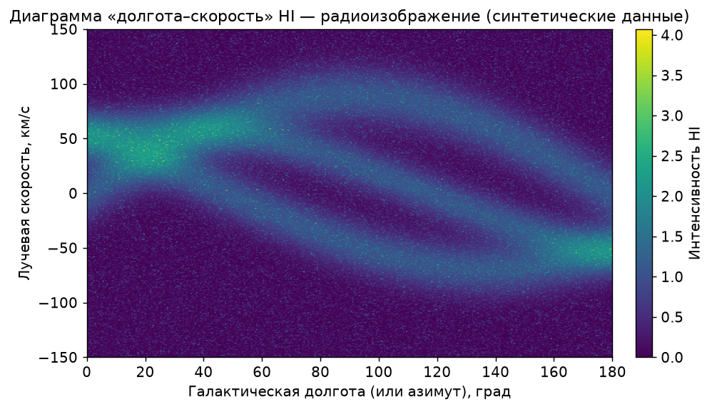
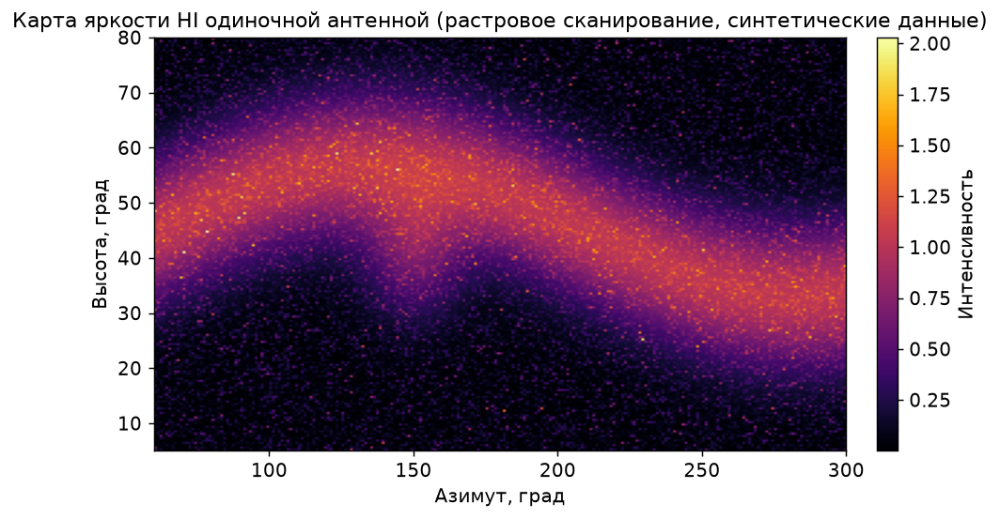

# Справочник: радиоизображения — получение и обработка

← [07. Анализ данных](../07-data-analysis.md) · [Оглавление](../../README.md) · [Глоссарий](../glossary.md)

---

Это **справочный** материал уровня выше первой линии HI. Он объясняет, как из радионаблюдений получают не просто спектр, а **изображение**, и как такие изображения обрабатывают. Часть методов доступна продвинутому любителю, часть — уровень обсерваторий; в тексте это разграничено.

Содержание:

- [Что такое радиоизображение](#что-такое-радиоизображение)
- [Путь 1 — картирование одиночной антенной](#путь-1--картирование-одиночной-антенной)
- [Путь 2 — интерферометрия и синтез апертуры](#путь-2--интерферометрия-и-синтез-апертуры)
- [Обработка: от отсчётов к карте](#обработка-от-отсчётов-к-карте)
- [Программное обеспечение](#программное-обеспечение)
- [Что реально доступно любителю](#что-реально-доступно-любителю)
- [Открытые изображения для сравнения](#открытые-изображения-для-сравнения)

---

## Что такое радиоизображение

В оптике изображение формируется объективом сразу. В радиодиапазоне «изображение» — это **карта интенсивности излучения по направлениям на небе**, построенная из множества отдельных измерений.

Для спектральной линии (например, HI) результат ещё богаче — это **куб данных**: две координаты на небе плюс третья ось (частота или лучевая скорость). Из куба извлекают:

- **карту интегральной интенсивности** (moment 0) — «сколько всего водорода» в каждом направлении;
- **карту поля скоростей** (moment 1) — средняя лучевая скорость в каждом направлении;
- **карту дисперсии скоростей** (moment 2) — ширина линии.

Частный, но очень наглядный вид радиоизображения для галактического HI — **диаграмма «долгота–скорость» (l–v)**: по одной оси направление, по другой лучевая скорость, яркость — интенсивность. Диагональные гребни на ней отражают вращение Галактики.



*Пример l–v диаграммы (синтетические данные). Реальные обзоры выглядят похоже: гребни соответствуют спиральным рукавам и дифференциальному вращению Галактики.*

---

## Путь 1 — картирование одиночной антенной

**Single-dish mapping** — самый доступный способ получить радиоизображение дома.

### Идея

Одиночная антенна в каждый момент «смотрит» в одном направлении с угловым разрешением порядка ширины луча:

```text
θ ≈ λ / D      (подробнее — в основах физики, гл. 02)
```

Изображение строится **растровым сканированием**: антенна последовательно наводится в узлы сетки направлений (по азимуту и высоте либо по RA/Dec), в каждом узле выполняется измерение (уровень континуума или интеграл линии за фиксированное время), затем значения собираются в двумерную карту.



*Пример карты яркости, полученной растровым сканированием (синтетические данные): яркая полоса — плоскость Млечного Пути.*

### Практические аспекты

- **Шаг сетки** согласуют с шириной луча: узлы чаще, чем θ, не добавляют деталей, но полезны для сглаживания (передискретизация).
- **Время на узел** определяет чувствительность (SNR ∝ √τ). Карта — это компромисс между разрешением, покрытием и временем.
- **Дрейф усиления и частоты** за время съёмки карты искажает уровни; помогают периодические возвраты на опорную точку и калибровка.
- **Привязка координат**: каждому узлу сопоставляются время (UTC), азимут/высота и, при необходимости, пересчёт в галактические/экваториальные координаты.
- **Gridding**: разрозненные измерения интерполируют на регулярную сетку для отображения (`imshow`, контурные карты).

Разрешение такой карты ограничено: домашняя антенна видит только **крупные структуры** (полоса Галактики, сильные области), но этого достаточно, чтобы получить узнаваемое радиоизображение неба в линии HI.

Связанные проекты — азимутальный скан и карта «скорость–азимут» — описаны в [08. Проекты](../08-projects.md).

---

## Путь 2 — интерферометрия и синтез апертуры

Чтобы получить **высокое** угловое разрешение, одиночной антенны недостаточно: из θ ≈ λ/D видно, что для деталей в доли угловой минуты на λ = 21 см потребовалось бы зеркало в сотни метров. Решение — **интерферометрия**.

### Принцип

Массив из нескольких антенн работает как части одного огромного «виртуального» зеркала:

- каждая **пара** антенн измеряет **видность** (visibility) — комплексную величину, характеризующую сигнал на данной **базе** (расстоянии и ориентации между антеннами);
- каждая база соответствует одной **пространственной частоте** — точке в так называемой **uv-плоскости**;
- чем больше разных баз, тем полнее заполнена uv-плоскость и тем детальнее итоговое изображение.

### Синтез апертуры и деконволюция

1. Набор видностей — это, по сути, выборка Фурье-образа изображения неба.
2. Обратное преобразование Фурье даёт **«грязное» изображение** (dirty image) — истинную картину, свёрнутую с **«грязным лучом»** (dirty beam, функция рассеяния прибора), форма которого задаётся заполнением uv-плоскости.
3. Алгоритмы **деконволюции** (классический **CLEAN** и его варианты) восстанавливают «чистое» изображение, убирая артефакты грязного луча.
4. **Самокалибровка** (self-calibration) итеративно уточняет фазы и амплитуды.

**Вращение Земли** со временем меняет проекции баз и дополнительно заполняет uv-плоскость (Earth-rotation aperture synthesis) — поэтому длительные наблюдения дают более качественное изображение.

Это уровень профессиональных инструментов (VLA, ALMA, LOFAR и др.). Любителю доступна **учебная двухэлементная интерферометрия** — как инженерный проект, демонстрирующий интерференцию и понятие базы, но не построение полноценных изображений галактик.

---

## Обработка: от отсчётов к карте

Типичный пайплайн (для single-dish HI-карты):

```text
Сырые спектры по узлам сетки
        ↓
Калибровка (полоса, усиление, PPM, baseline)
        ↓
Пересчёт частота → лучевая скорость
        ↓
Сборка куба:  [координата1] × [координата2] × [скорость]
        ↓
Моменты: интеграл линии (m0), поле скоростей (m1), ширина (m2)
        ↓
Gridding + отображение (imshow / контуры)
```

Учебный пример: построение карты «азимут × скорость» из набора спектров (в стиле кода из [07. Анализ данных](../07-data-analysis.md)):

```python
import numpy as np
import matplotlib.pyplot as plt

C = 299792.458   # км/с
F0 = 1420.405751  # МГц

def mhz_to_v(freq_mhz):
    return C * (F0 - freq_mhz) / F0

# spectra: список кортежей (азимут_град, freq_mhz[], power[])
# все спектры сведены к общей частотной сетке freq_grid
azimuths = sorted({az for az, _, _ in spectra})
v_grid = mhz_to_v(freq_grid)                 # ось скорости
img = np.zeros((len(azimuths), v_grid.size))

for i, az in enumerate(azimuths):
    rows = [p for a, f, p in spectra if a == az]
    img[i] = np.mean(rows, axis=0)           # усреднение по повторам

img -= np.median(img, axis=1, keepdims=True)  # грубое вычитание baseline

plt.imshow(img.T, aspect="auto", origin="lower",
           extent=[azimuths[0], azimuths[-1], v_grid[-1], v_grid[0]],
           cmap="viridis")
plt.xlabel("Азимут, град")
plt.ylabel("Лучевая скорость, км/с")
plt.colorbar(label="Интенсивность HI")
plt.title("Карта азимут–скорость (собственные данные)")
plt.show()
```

Ключевые приёмы обработки:

- **Baseline**: аккуратно вычесть аппаратную «чашу», не подавив реальный широкий профиль (см. [07. Анализ данных](../07-data-analysis.md)).
- **Единицы**: интенсивность имеет смысл выражать в яркостной температуре (К) после калибровки; на старте достаточно относительных единиц.
- **Координатная привязка** (WCS) нужна, чтобы сравнивать карту с обзорами.
- **Сглаживание** уменьшает шум, но снижает разрешение — компромисс подбирается под задачу.

---

## Программное обеспечение

| Задача | Инструменты |
|--------|-------------|
| Запись/потоковое усреднение | GNU Radio, собственные скрипты |
| Анализ и построение карт (любитель) | Python: numpy, scipy, matplotlib, **astropy** |
| Формат данных изображений/кубов | **FITS** (+ координаты WCS) |
| Визуализация FITS | APLpy, DS9, Aladin |
| Профессиональная интерферометрия | **CASA**, WSClean, AIPS, Miriad |

Для любителя достаточно связки **Python + astropy**: astropy читает/пишет FITS, работает с координатами и временем. Профессиональные пакеты (CASA и др.) нужны при работе с интерферометрическими данными.

---

## Что реально доступно любителю

**Реалистично (single-dish, RTL-SDR + направленная антенна):**

- карта яркости полосы Млечного Пути в линии HI;
- диаграмма «долгота–скорость» по серии направлений;
- карта Солнца по континууму (грубая).

**Продвинуто:**

- двухэлементная учебная интерферометрия (демонстрация принципа);
- транзитные карты (использование вращения Земли для прохождения источника через неподвижный луч).

**Не для домашней установки:**

- изображения радиогалактик высокого разрешения;
- слабые внегалактические источники;
- всё, что требует большой апертуры или крупного массива антенн.

Ориентир: домашнее радиоизображение — это **узнаваемая структура крупного масштаба**, а не детальная картинка. Ценность — в самостоятельном получении и корректной обработке.

---

## Открытые изображения для сравнения

Собственные карты полезно сопоставлять с публичными обзорами и галереями (поиск по названиям):

- **HI4PI**, **LAB HI Survey** — полнонебесные обзоры нейтрального водорода (эталон для HI-карт и l–v диаграмм).
- **SkyView Virtual Observatory** (NASA) — доступ к изображениям неба в разных диапазонах, включая радио.
- **NRAO Image Gallery**, **NRAO/VLA Sky Survey (NVSS)** — радиоизображения профессионального уровня.
- **CASA Guides** — учебные материалы по обработке интерферометрических данных.

Цель сравнения — не воспроизвести научную карту один в один, а убедиться, что структура собственного результата согласуется с реальностью (где сигнал сильнее, как расположены гребни на l–v диаграмме и т. п.).

---

← [07. Анализ данных](../07-data-analysis.md) · [08. Проекты →](../08-projects.md) · [Оглавление](../../README.md)
